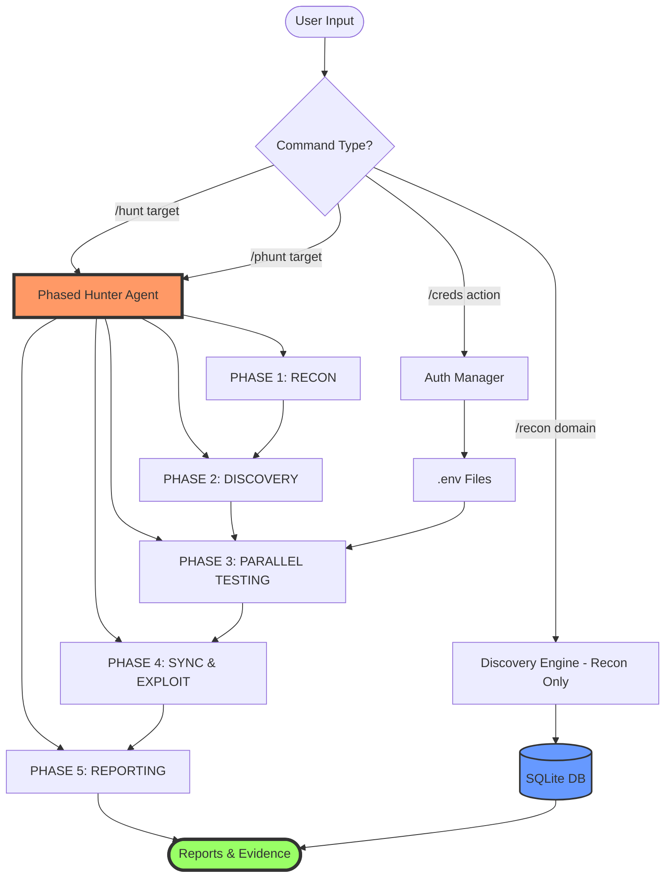
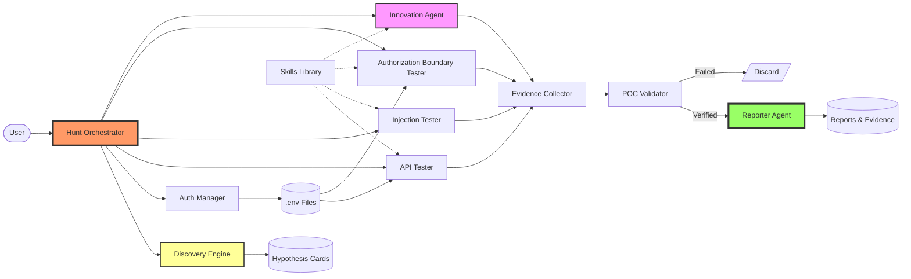
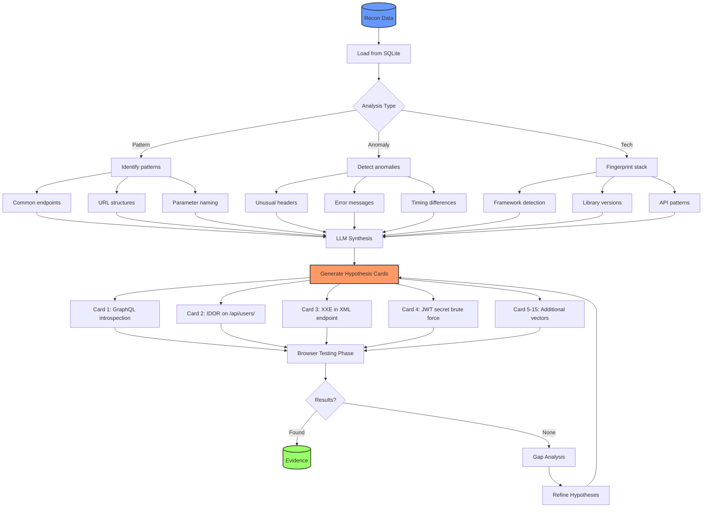
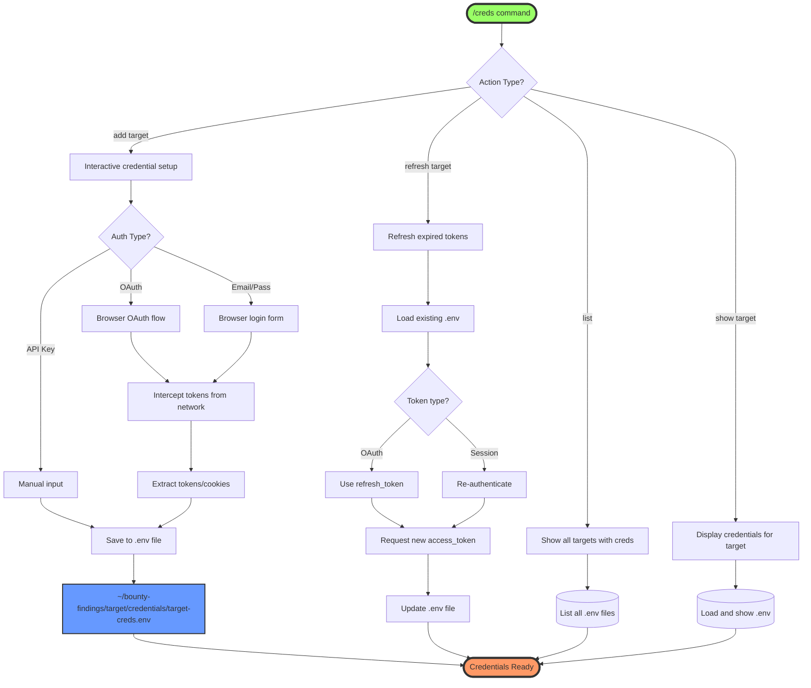
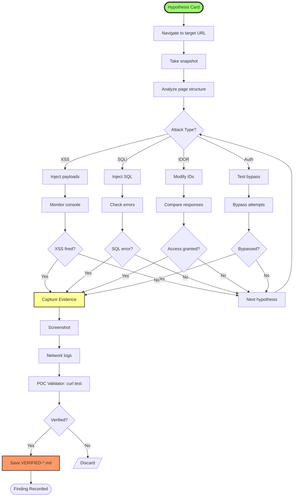
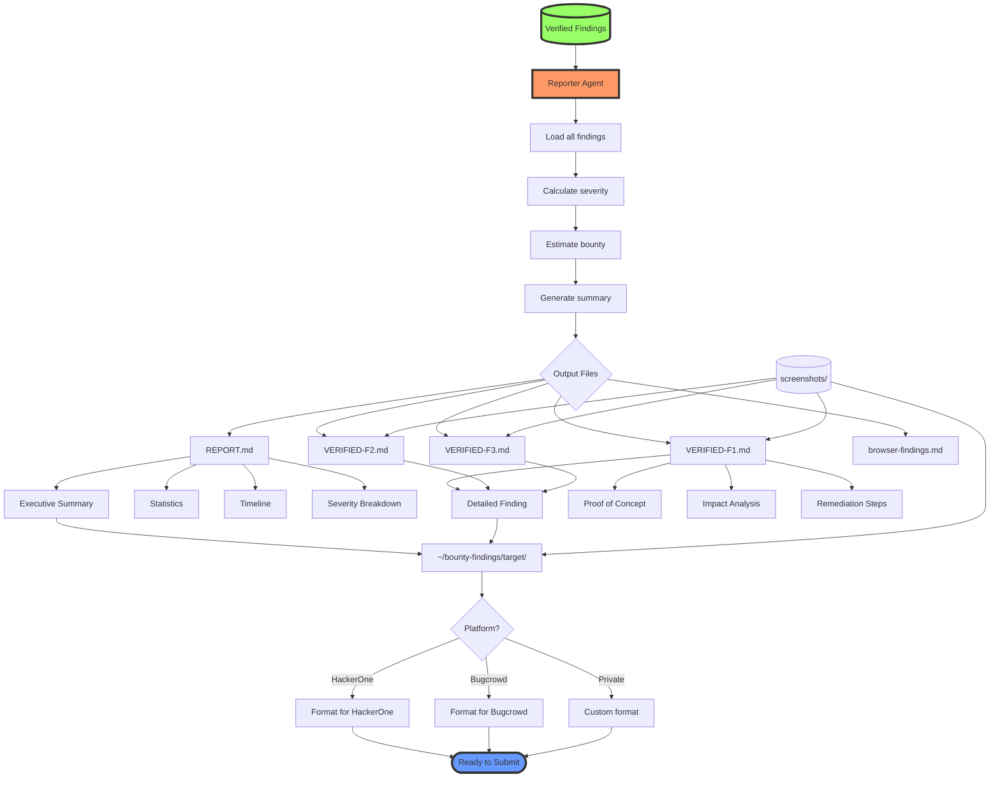
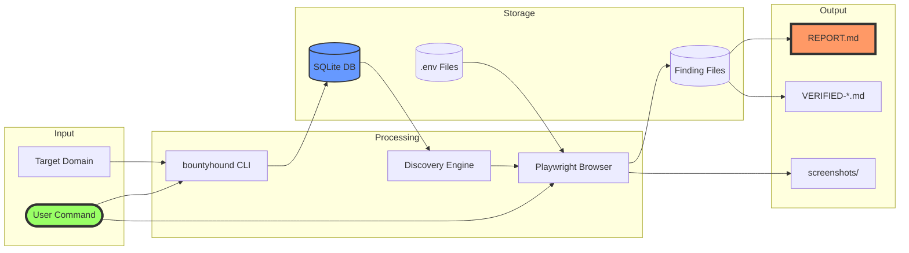
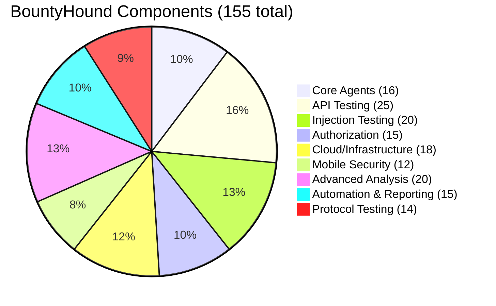

# BountyHound System Flowchart

## Master System Architecture



---

## Detailed Phased Hunt Flow

```mermaid
graph TB
    Start([/hunt example.com]) --> Check{Target in Scope?}

    Check -->|No| Abort([Error: Out of Scope])
    Check -->|Yes| Phase1[PHASE 1: RECON]

    subgraph PHASE1[" PHASE 1: RECON (~5 min) "]
        R1[Run: bountyhound recon example.com]
        R2[Subfinder: Find subdomains]
        R3[httpx: Probe live hosts]
        R4[nmap: Port scanning]
        R5[Save to ~/.bountyhound/bountyhound.db]

        R1 --> R2 --> R3 --> R4 --> R5
    end

    Phase1 --> Phase2[PHASE 1.5: DISCOVERY ENGINE]

    subgraph PHASE2[" PHASE 1.5: DISCOVERY (~2 min) "]
        D1[Load recon data from DB]
        D2[LLM: Pattern synthesis]
        D3[LLM: Anomaly detection]
        D4[LLM: Technology fingerprinting]
        D5[Generate 5-15 hypothesis cards]
        D6{Novel vectors found?}

        D1 --> D2 --> D3 --> D4 --> D5 --> D6
    end

    Phase2 --> Phase3[PHASE 2: PARALLEL TESTING]

    subgraph PHASE3[" PHASE 2: PARALLEL TESTING (~15 min) "]
        direction LR

        T1A[Track A: bountyhound scan]
        T1B[Nuclei templates]
        T1C[Background process]

        T2A[Track B: Browser Testing]
        T2B[Test hypothesis cards]
        T2C[Manual attack chains]
        T2D[Injection attacks]
        T2E[Auth bypass]
        T2F[IDOR testing]

        T1A --> T1B --> T1C
        T2A --> T2B --> T2C
        T2C --> T2D
        T2C --> T2E
        T2C --> T2F
    end

    Phase3 --> Phase4[PHASE 3: SYNC]

    subgraph PHASE4[" PHASE 3: SYNC (~2 min) "]
        S1[Merge CLI findings]
        S2[Merge browser findings]
        S3{Findings > 0?}
        S4[Gap analysis]
        S5[Trigger discovery engine again]

        S1 --> S2 --> S3
        S3 -->|No| S4 --> S5 --> S2
        S3 -->|Yes| S6[Proceed to exploitation]
    end

    Phase4 --> Phase5[PHASE 4: EXPLOIT]

    subgraph PHASE5[" PHASE 4: EXPLOIT (~5 min) "]
        E1[Select high-value findings]
        E2[POC Validator: curl validation]
        E3{Verified?}
        E4[Capture evidence]
        E5[Screenshots]
        E6[Request/Response logs]
        E7[Discard false positive]

        E1 --> E2 --> E3
        E3 -->|Yes| E4 --> E5 --> E6
        E3 -->|No| E7
    end

    Phase5 --> Phase6[PHASE 5: REPORTING]

    subgraph PHASE6[" PHASE 5: REPORTING (~3 min) "]
        RP1[Reporter Agent: Generate REPORT.md]
        RP2[Create individual VERIFIED-*.md files]
        RP3[Organize screenshots]
        RP4[Calculate severity/bounty estimates]
        RP5[Save to ~/bounty-findings/target/]

        RP1 --> RP2 --> RP3 --> RP4 --> RP5
    end

    Phase6 --> End([Hunt Complete])

    style Start fill:#9f6,stroke:#333,stroke-width:4px
    style End fill:#f96,stroke:#333,stroke-width:4px
    style PHASE1 fill:#e1f5ff,stroke:#333,stroke-width:2px
    style PHASE2 fill:#fff4e1,stroke:#333,stroke-width:2px
    style PHASE3 fill:#ffe1f5,stroke:#333,stroke-width:2px
    style PHASE4 fill:#e1ffe1,stroke:#333,stroke-width:2px
    style PHASE5 fill:#f5e1ff,stroke:#333,stroke-width:2px
    style PHASE6 fill:#ffe1e1,stroke:#333,stroke-width:2px
```



---

## Agent Interaction Flow



---

## Discovery Engine Deep Dive



---

## Credential Management Flow



---

## Browser Testing Workflow



---

## Skills Library Structure

```mermaid
graph TB
    Skills[Skills Library] --> Injection[injection-attacks/]
    Skills --> Auth[auth-attacks/]
    Skills --> WAF[waf-bypass/]
    Skills --> Scope[scope-parser/]
    Skills --> Report[report-psychology/]
    Skills --> Cred[credential-manager/]

    Injection --> XSS[XSS payloads]
    Injection --> SQLi[SQL injection]
    Injection --> SSTI[Template injection]
    Injection --> XXE[XXE payloads]
    Injection --> CMD[Command injection]

    Auth --> JWT[JWT attacks]
    Auth --> OAuth[OAuth bypass]
    Auth --> Session[Session attacks]
    Auth --> 2FA[2FA bypass]

    WAF --> Encoding[Encoding techniques]
    WAF --> Obfuscation[Payload obfuscation]
    WAF --> Fragmentation[Request fragmentation]

    Scope --> Parse[Parse bounty program rules]
    Scope --> Validate[Validate targets]
    Scope --> Exclude[Check exclusions]

    Report --> Psychology[Writing techniques]
    Report --> Templates[Report templates]
    Report --> Severity[Severity scoring]

    Cred --> Storage[.env management]
    Cred --> Refresh[Token refresh]
    Cred --> MultiUser[Multi-user support]

    style Skills fill:#f96,stroke:#333,stroke-width:4px
    style Injection fill:#ff9,stroke:#333,stroke-width:2px
    style Auth fill:#9f9,stroke:#333,stroke-width:2px
    style WAF fill:#f9f,stroke:#333,stroke-width:2px
```



---

## Output Generation Flow



---

## Timeline: Full Hunt Execution

```mermaid
gantt
    title BountyHound Hunt Timeline (Total: ~29 minutes)
    dateFormat mm:ss
    axisFormat %M:%S

    section Phase 1: Recon
    bountyhound recon           :00:00, 5m
    subfinder                   :00:00, 2m
    httpx                       :02:00, 2m
    nmap                        :04:00, 1m

    section Phase 1.5: Discovery
    Load recon data             :05:00, 30s
    LLM analysis                :05:30, 1m
    Generate hypotheses         :06:30, 30s

    section Phase 2: Parallel Testing
    Track A: nuclei scan        :07:00, 15m
    Track B: browser test 1     :07:00, 2m
    Track B: browser test 2     :09:00, 2m
    Track B: browser test 3     :11:00, 2m
    Track B: browser test 4     :13:00, 2m
    Track B: browser test 5     :15:00, 2m

    section Phase 3: Sync
    Merge findings              :22:00, 1m
    Gap analysis                :23:00, 1m

    section Phase 4: Exploit
    POC validation              :24:00, 3m
    Capture evidence            :27:00, 2m

    section Phase 5: Report
    Generate reports            :29:00, 3m
```

---

## Data Flow Diagram



---

## Component Count Breakdown



